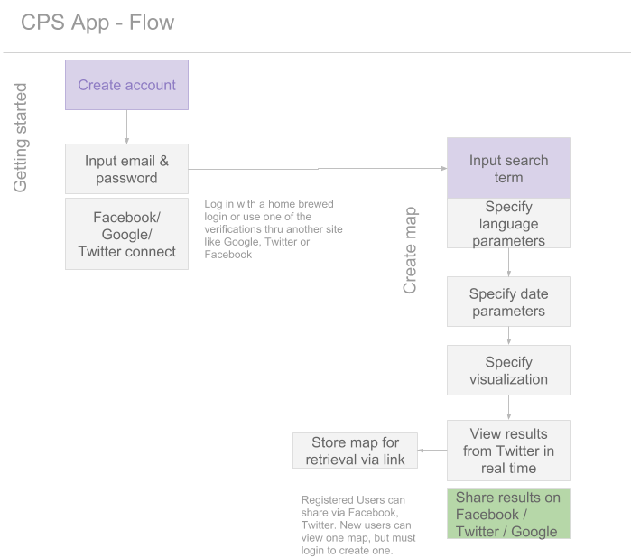

# Read Me
## Project Overview 
Team CPS will create an app that will monitor and geo-locate Twitter mentions of specified user search terms.

This app will be utlilize Mongo, Express & Node.js on the backend  along with JavaScript, JQuery, HTML5 & CSS on the front end. This app will be deployed on Heroku and use Modulus or Mongolab for the database.

### Technologies used:

APIs used will be: User API, Google Maps API and Twitter API. For visualization, we are using D3.

## Product Development Prioritization Key:
Priority: 1 - Absolutely necessary
Priority: 2 - Nice to have, beyond MVP
Priority: 3 - On backlog 

## User Story With Prioritization:

* User creates an account with a username (unique email) and password (Priority 1)

* User can login with Google, Facebook or Twitter (Priority 2) 

* User is directed to a page with a map and an input box with button labeled gimme

*  User may also specify a date range (Priority 3)
User inputs a term and hits the gimme button (Priority 1) 

* The page then renders the map with indicators of mentions of the term in real time (Priority 1) 

* User can then share a link to the map on Facebook, Twitter (Priority 2)

## App Flow Diagarm 
